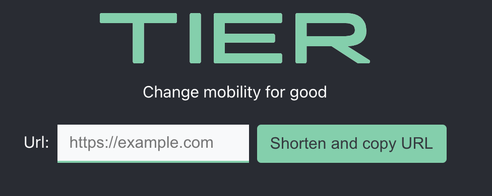

# User interface to shorten URLs

 </img>

## Tech stack

- [React](https://reactjs.org/)
- [Axios](https://github.com/axios/axios)
- [Prettier](https://prettier.io/)
- [Eslint](https://eslint.org/)
- [Jest](https://jestjs.io/)

## How to run application


1. Clone the stable branch

```
git clone git@github.com:vadimfrolov/url-shortener.git
cd url-shortener
```

2. Create .env file in root folder with your key

```
REACT_APP_BITLY_AUTHORIZATION_TOKEN = 'your bitly token'
```


3. Install packages

```
yarn install
```

4. Run app

```
yarn start
```

## How to run tests


1. Install packages

```
yarn install
```

2. Run tests

```
yarn test
```


## Project structure
```bash

├── src                    	
│   ├── css                  	# styles
│   ├── img                  	# images
│   ├── components              # app components
│   ├── api              	# axios utility
│   └── utils                  	# utils

```

## Road map
- [ ] add more tests
- [ ] create demo on Heroku
- [ ] create Gitlab CI/CD pipeline to Github actions and dockerhub registry.
